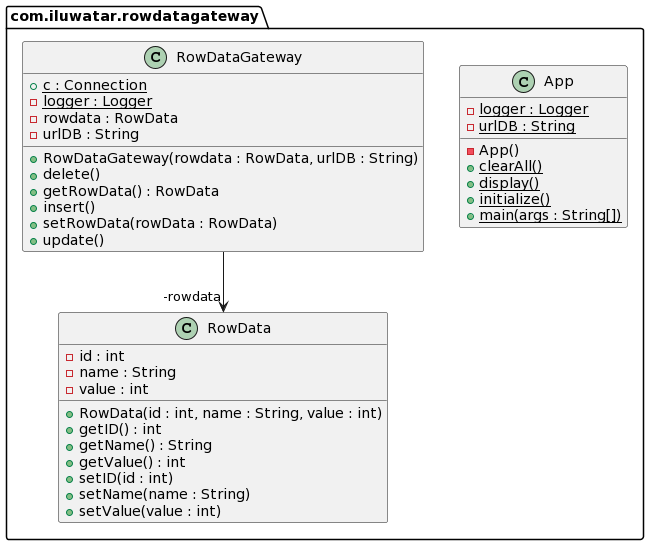

## Also known as


## Intent

Acts a gateway to a single record in a database. One instance per row. Contains no domain logic.

## Explanation

Real-world example

> Consider your company wants to reduce their reliance on SQL-literate employees.
> To achieve this, they create a Row Data Gateway within their software.
> This allows for ordinary employees to interact with SQL without knowing SQL-specific language.

In Plain Words

> Row Data Gateway is about accessing a row in a database without the user having to directly use SQL.

**Programmatic Example**

A Row Data Gateway acts as an object that mimics a single record, i.e. a single row of a database.
In my example, `rowData` class has `id`, `Name` and `Value` fields.

The `RowData` class:
```java
public class RowData {
  private int id;
  private String name;
  private int value;

  /**
   * Public constructor.
   * i is the ID of the row, should always be present.
   * the following data types and the number of them should vary depending on the Columns of the SQL Table.
   * @param id: id of the row
   * @param name: name of the row 
   * @param value: value of the row
   */
  public RowData(int id, String name, int value) {
    this.id = id;
    this.name = name;
    this.value = value;
  }
  /**
   * Gets current name of the rowData.
   */
  public String getName() {
    return name;
  }

  /**
   * Sets current name of the rowData.
   * @param name String
   */
  public void setName(String name) {
    this.name = name;
  }
  /**
   * Gets current Value of the rowData.
   */
  public int getValue() {
    return value;
  }
  /**
   * Sets current value of the rowData.
   * @param value int
   */
  public void setValue(int value) {
    this.value = value;
  }
  /**
   * Gets current ID of the rowData.
   */
  public int getID() {
    return id;
  }
  /**
   * Sets current ID of the rowData.
   * @param id int
   */
  public void setID(int id) {
    this.id = id;
  }
}
```

The features in the above class correlate to the features of the column of the table.
This class holds the data about a row so that a client can access the Row Data Gateway directly.
The gateway acts as an interface for each row of data in the database.

The `RowDataGateway` class:
```java
public class RowDataGateway {
  /**
   * Logger.
   */
  private static final Logger logger = LoggerFactory.getLogger(RowDataGateway.class);
  /**
   * Variables to store the URL and rowData.
   */
  private RowData rowdata;
  private final String urlDB;
  public static Connection c = null;

  /**
   * Public constructor.
   * @param rowdata rowData
   * @param urlDB String
   */
  public RowDataGateway(RowData rowdata, String urlDB) {
    this.rowdata = rowdata;
    this.urlDB = urlDB;
  }

  /**
   * Method to get current rowData.
   */
  public RowData getRowData() {
    return rowdata;
  }
  /**
   * Method to set the current rowData, useful when preparing for Update for example.
   * @param rowData rowData
   */
  public void setRowData(RowData rowData) {
    this.rowdata = rowData;
  }

  /**
   * Insert part of the Data Pattern.
   * Purpose is to insert the current rowData in scope into the SQL table.
   */
  public void insert() {
      ...
  }
  /**
   * Update part of the Data Pattern.
   * Purpose is to update the row with matching ID to the new rowData.
   */
  public void update() {
    ...
  }
  /**
   * Delete part of the Data Pattern.
   * Purpose is to update the row with matching ID to the new rowData.
   */
  public void delete() {
    ...
  }
}

```
The `App` class acts as the external software implementing this design pattern, and shows how to insert, update and delete.
The `App` class:
```java
package com.iluwatar.rowdatagateway;

import java.sql.Connection;
import java.sql.DriverManager;
import java.sql.ResultSet;
import java.sql.SQLException;
import java.sql.Statement;

/**
 * This acts as a 'gateway' to a single record in a database, with one instance per row.
 * Here, 'gateway' means that it enables the user to interact with the SQL database without directly using SQL language.
 *
 * <p>In this example, I use the row data gateway pattern to access a rowData table.
 * The main method initialises an instance of {@link RowDataGateway}
 * for each row, allowing access and interactions with each row in the database
 * through Insert, Update and Delete methods in {@link RowDataGateway}</p>
 */
public class App {
  /**
   * Logger.
   */
  private static final Logger logger = LoggerFactory.getLogger(App.class);
  /**
   * The URL that determines the database to connect to. In this example code, this is SQLLite's test database.
   */
  private static final String urlDB = "jdbc:sqlite:test.db";
  /**
   * Private, empty constructor.
   */
  private App() {
  }
  /**
   * Starting point for the program.
   * @param args command line args
   * @throws  SQLException if any error occur, since SQL code is necessary in  {@link RowDataGateway}
   */
  public static void main(String[] args) throws SQLException {
    //starting method to create a the table rowData and establish a connection to the database.
    initialize();

    //create three rowData objects and create three rowDataGateways to access the database.
    RowData row1 = new RowData(1,"John",20);
    RowData row2 = new RowData(2,"Mary",30);
    RowData row3 = new RowData(3,"Doe",40);

    RowDataGateway rowGateway1 = new RowDataGateway(row1,urlDB);
    RowDataGateway rowGateway2 = new RowDataGateway(row2,urlDB);
    RowDataGateway rowGateway3 = new RowDataGateway(row3,urlDB);

    rowGateway1.insert();
    rowGateway2.insert();
    rowGateway3.insert();
    display();
    row3.setName("Dobothy");
    rowGateway3.setRowData(row3);
    rowGateway3.update();
    display();
    rowGateway2.delete();
    display();
    //clear table and reset the database, ending the connection also.
    clearAll();
  }
  /**
   * Initializes the connection to the database and creates table to interact with in this example.
  */
  public static void initialize() {
    ...
  }
  /**
   * Deletes the table and ends the connection to the database.
  */
  public static void clearAll() {
    ...
  }

  /**
   * Prints the database row-by-row to the terminal, useful in testing and understanding the code.
  */
  public static void display() {
    ...
  }
}

```
Here's the console output. You can see the three calls of `display()` printed. Display is not necessary for the Pattern,
but it is useful to help understand the process.

```
INSERT INTO rowDataTable (ID,NAME,VALUE) VALUES (1, 'John', 20);
INSERT INTO rowDataTable (ID,NAME,VALUE) VALUES (2, 'Mary', 30);
INSERT INTO rowDataTable (ID,NAME,VALUE) VALUES (3, 'Doe', 40);
ID = 1
NAME = John
VALUE = 20

ID = 2
NAME = Mary
VALUE = 30

ID = 3
NAME = Doe
VALUE = 40

ID = 1
NAME = John
VALUE = 20

ID = 2
NAME = Mary
VALUE = 30

ID = 3
NAME = Dobothy
VALUE = 40

ID = 1
NAME = John
VALUE = 20

ID = 3
NAME = Dobothy
VALUE = 40


Process finished with exit code 0
```

## Class diagram



## Applicability

Row Data Gateway is often used with a transaction script pattern, or has more features added to make it an Active Record.
All of which are used widely when interfacing with a database or other datasource.

## Related patterns

- Active Record Pattern

- [Transaction Script](https://java-design-patterns.com/patterns/transaction-script/)

## Tutorial

* [Bridge Pattern Tutorial](https://www.journaldev.com/1491/bridge-design-pattern-java)

## Credits

* [Row Data Gateway Pattern](https://www.sourcecodeexamples.net/2018/04/row-data-gateway.html)
* [SQLite - Java](https://www.tutorialspoint.com/sqlite/sqlite_java.htm)
